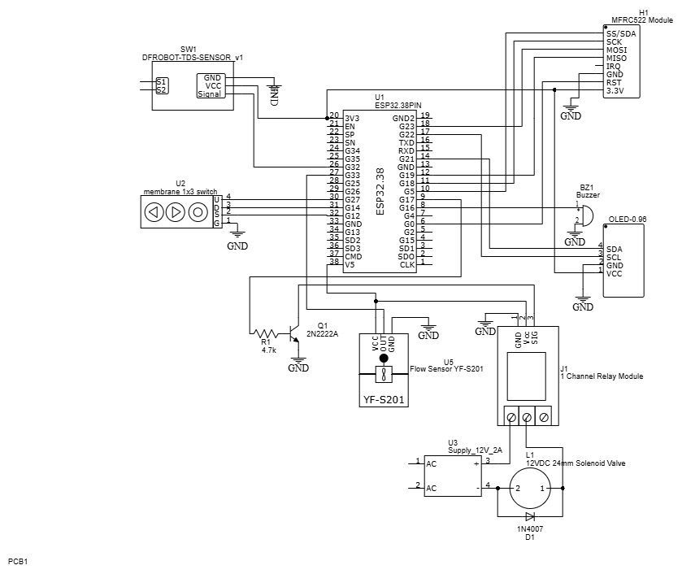

# Water Dispensing System with RFID Container Detection and Quality Monitoring (codename: DALISAY)

DALISAY is an RFID-based smart water dispensing system that monitors and controls water flow, quality, and usage with real-time feedback on an OLED display. Users scan an RFID-tagged container to identify its volume, then control the filling process using physical buttons.

## ✨ Features
- 💧 Flow monitoring using a flow sensor to **measure dispensed water volume**.
- 🌊 TDS (Total Dissolved Solids) sensor to **assess water quality**.
- 🛂 RFID reader to **detect pre-registered containers** and set their maximum volume.
- 🖥️ OLED display to show:
    - **Water volume dispensed** and its **cost** (based on PHP per liter)
    - Real-time **water quality rating** (IDEAL, GOOD, FAIR, BAD)
    - Container **fill status** and **valve state**.
- 🎮 Buttons for control, allowing users to **start/stop** the valve and **adjust desired fill volume**.

## ✅ Benefits
- 💧 **Saves water and protects environment** through intelligent flow management
- 💸 **Helps save money** by increasing awareness of water consumption and cost
- ⏱️ **Saves time** by automating the filling process
- 🛡️ **Enhances public health** by ensuring water is safe from contaminants

## 📐 Schematic Diagram

**ESP32 microcontroller** receives data from four main input sources: a **TDS sensor (DFROBOT-V1)** for monitoring water quality, a **flow sensor (YF-S201)** to measure the dispensed volume, an **RFID reader (MFRC522)** for identifying containers, and three **push buttons** for user interaction. The ESP32 processes this data and controls output devices, including an **OLED display (SSD1306)** and a **passive buzzer** for real-time feedback, and a **relay module** that drives a **solenoid valve** to control water flow. A **12V power supply** provides the necessary power for high-voltage components like the valve, with a **2N2222A transistor** used to safely switch the relay. Finally, a **flyback diode (1N4007)** protects against voltage spikes during relay switching.
